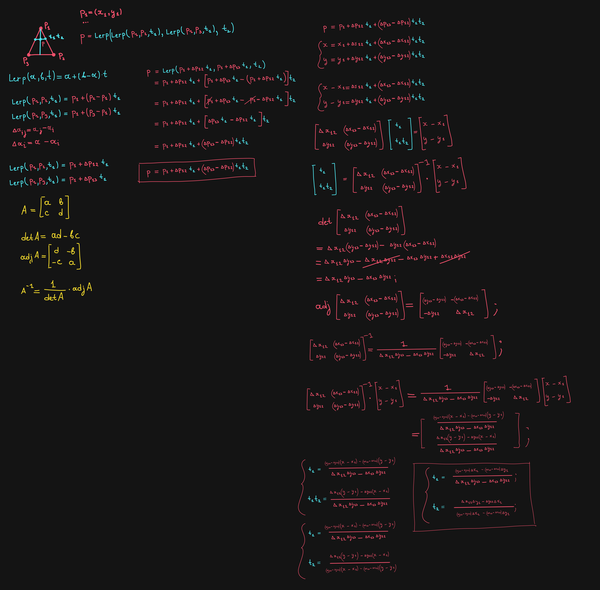

# Triangle Coordinates

Triangle Coordinates system I came up with for my Color Picker. It feels like it's basically a variant of Barycentric Coordinates, but I'm actually not sure about it. There is no constrains on the same of the parameters `t₁` and `t₂`. The only constraint is that they must be the values between 0 and 1.

But maybe this is a variant of Barycentric Coordinates, I don't know, I'm not good at math.

